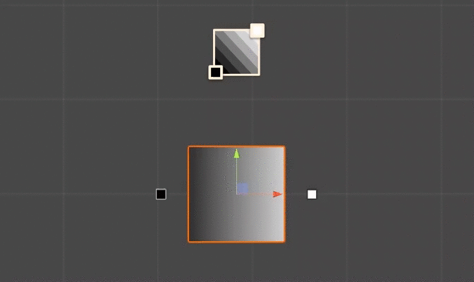

# Gradient-Mask-Shader
Small tool template which calculates matrix for gradient based on position of two points in worldspace. Than transfers it into the shader of gameobject. This gradient can be used in shader for vast variety of purposes from simple transparency gradient setup to composing of complicated effects using such kind of gradient masking. Though currently it is just basic implementation right now. More like proof of concept.

## Preview

